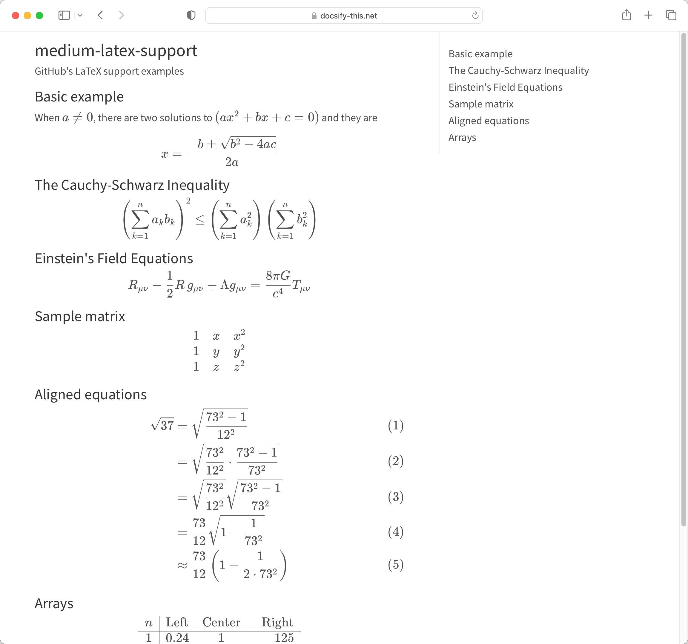
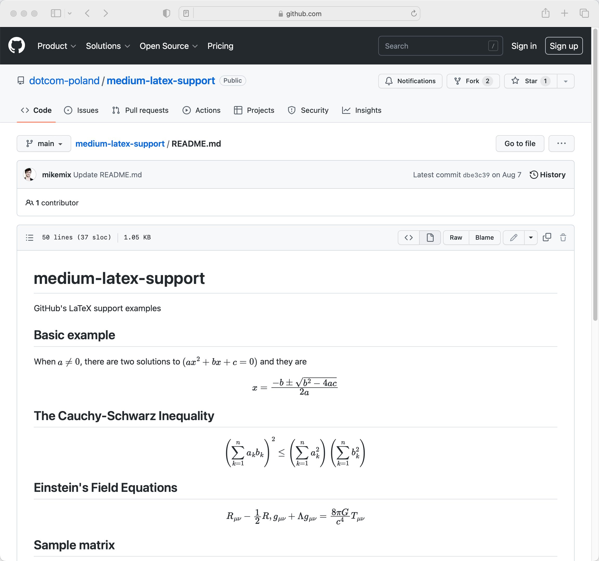
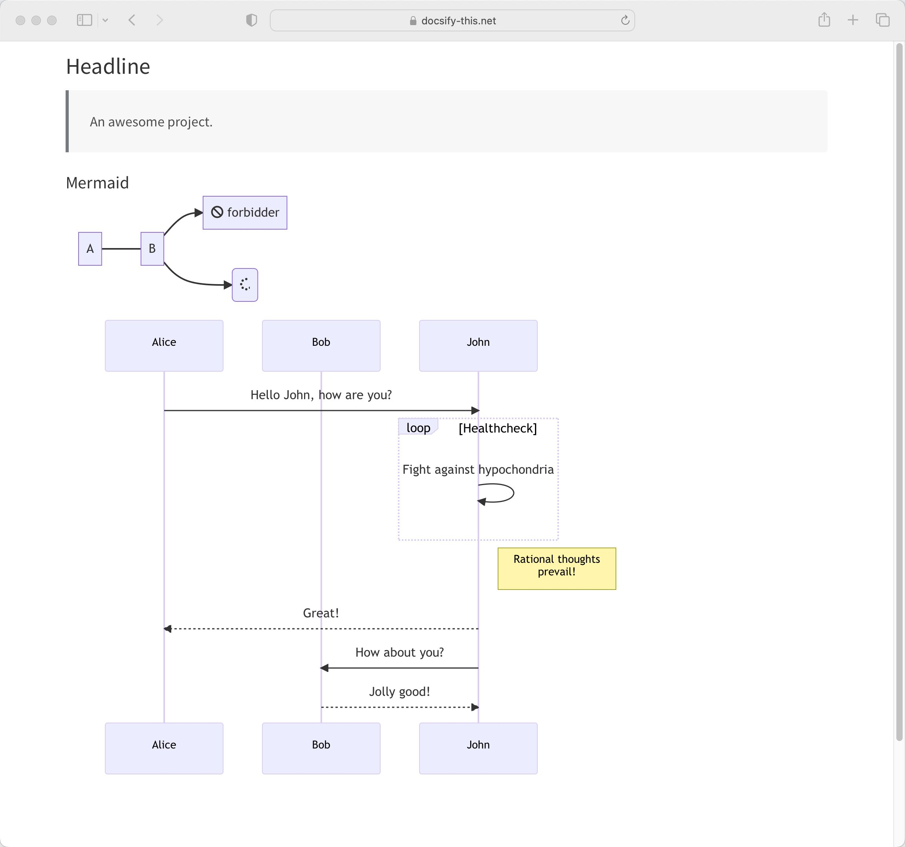
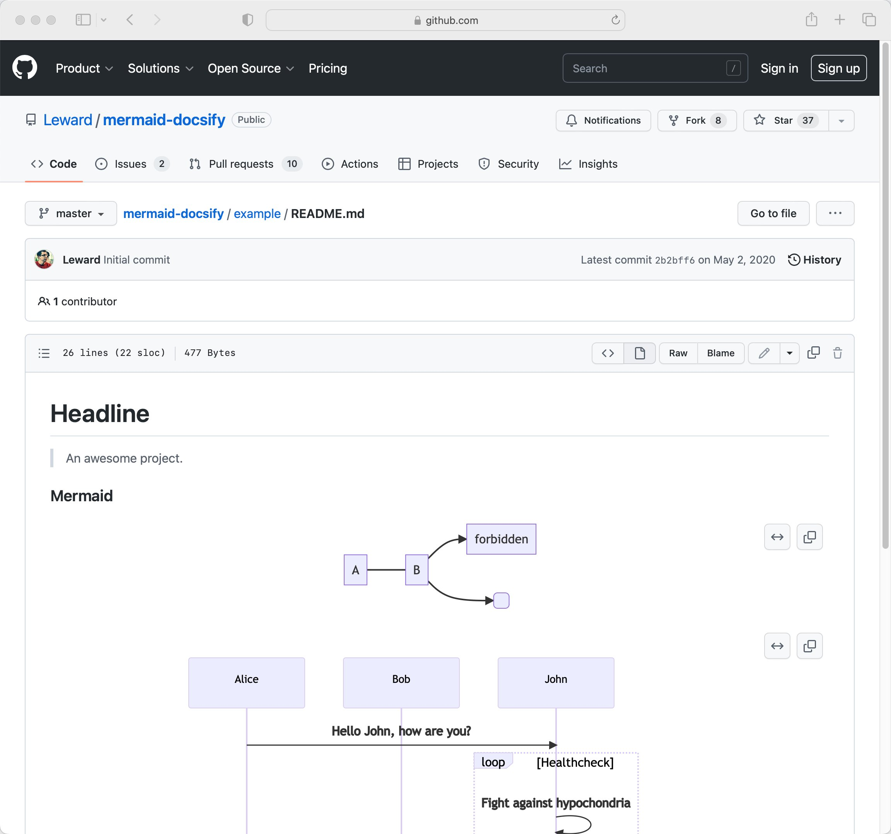
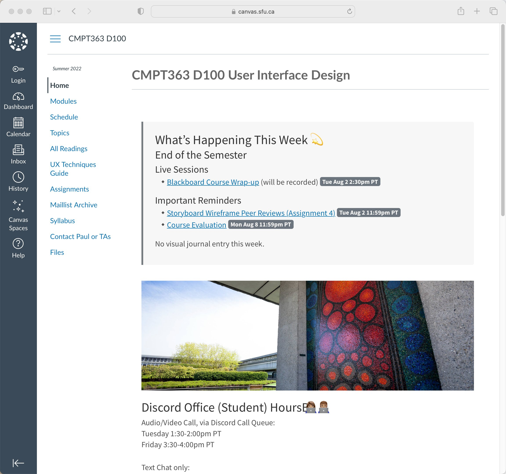

> 📢http://Docsify-This.net v1.2.1 is now available📢 Support for KaTeX (mathematical equations) + Mermaid Diagrams, both of which are provided with the GitHub #Markdown editor👇🏼 Docsify-This might just be the easiest way to turn a GitHub #Markdown file into a simple web page! #OER 
> 
> 
> 
> 
> 
> 
> 
> 

 [Tue Nov 01 16:58:37 +0000 2022](https://twitter.com/hibbittsdesign/status/1587489297460264960)

----

Replying to [@hibbittsdesign](https://twitter.com/hibbittsdesign/status/1587489297460264960)

> While Docsify-This is easy to use, it can display media-rich Markdown files for embedding into various platforms. For example, here is a #CanvasLMS course which uses GitHub #Markdown files (which are fully versioned controlled and collaborative) as content https://canvas.sfu.ca/courses/69678 
> 
> 

 [Tue Nov 01 17:07:42 +0000 2022](https://twitter.com/hibbittsdesign/status/1587491585784418305)

----

Replying to [@hibbittsdesign](https://twitter.com/hibbittsdesign/status/1587491585784418305)

> Let's review the steps to go from a GitHub Markdown file to a web page with Docsify-This!
> 1️⃣ Create or view a #Markdown file on GitHub and copy the URL
> 2️⃣ Go to http://Docsify-This.net, paste the URL into the Web Page Builder (shown below), and tap "View as Standalone Web Page"🚀

 [Tue Nov 01 17:22:17 +0000 2022](https://twitter.com/hibbittsdesign/status/1587495254508601345)

----

> Solid article, and for my own application of consistency in design I usually add "... for the benefit of _______" to help focus on the right outcome. https://twitter.com/Amy_Hupe/status/1587727155114426368

 [Wed Nov 02 18:47:00 +0000 2022](https://twitter.com/hibbittsdesign/status/1587878959873916930)

----

> Key http://Docsify-This.net design aspects + processes👀
> 
> Design
> ∙Barriers of use/first use
> ∙Error prevent/handling
> ∙Mental models
> ∙Microcopy
> ∙Paradox of choice
> ∙Progressive disclosure
> Process
> ∙Iterative design in the open
> ∙Scenario-based design
> ∙Remote usability testing

 [Wed Nov 02 19:02:43 +0000 2022](https://twitter.com/hibbittsdesign/status/1587882915035512832)

----

> Have you used my open source http://Docsify-This.net project to display Markdown files as simple Web pages? If so, I'd appreciate you taking a minute or two to complete this brief survey https://forms.gle/awje7b1VuXT1aQED6 Thank you 🙏🏼

 [Thu Nov 03 17:07:34 +0000 2022](https://twitter.com/hibbittsdesign/status/1588216326119600128)

----

Replying to [@RyanMPierson](https://twitter.com/RyanMPierson/status/1588217095439151104)

> Indeed😉 The project is an effort to help lower the barrier to get people started with publishing with Markdown, with @getgrav as a possible destination for more complete site design needs🚀

 [Thu Nov 03 17:23:32 +0000 2022](https://twitter.com/hibbittsdesign/status/1588220342795137025)

----

Replying to [@hibbittsdesign](https://twitter.com/hibbittsdesign/status/1588216326119600128)

> I am also looking for additional participants with GitHub and/or Markdown experience for 15-minute remote usability sessions with http://Docsify-This.net, if you are interested you can apply at https://forms.gle/177iyE1TKmkwUVxF6. Only selected participants will be contacted.

 [Thu Nov 03 17:23:44 +0000 2022](https://twitter.com/hibbittsdesign/status/1588220396276371457)

----

> RT @QueenOfRats: Hi! Yes! It's me, a freelancer who's staring down the very real possibility that my decade plus career is going to vanish.

 [Fri Nov 04 17:53:51 +0000 2022](https://twitter.com/hibbittsdesign/status/1588590362872147968)

----

> Thanks to @etug and all the presenters for an insightful #ETUGFall2022 today🎉

 [Fri Nov 04 23:44:19 +0000 2022](https://twitter.com/hibbittsdesign/status/1588678559752945664)